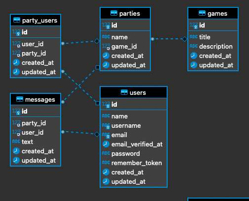
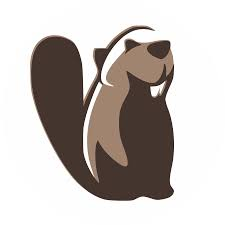

<h1 align="center">
  "GameLog" Gamer-friendly Api
</h1>

Challenge from the Fullstack Developer Bootcamp at <a href="https://geekshubsacademy.com/">GeeksHubs Academy</a> 

This project was made by [Guillermo Raez](https://github.com/GuillermoRaez), student at GeeksHubs Academy.

# About 🔧

The project itself consisted of creating a backend for gamers for them to be able to register and login, and create a unlimited number of parties for videogames they like to play with friends and strangers online.
The deployment could be made locally as it has been done in this project but also one of the tasks was to deploy with heroku.

The framework that we used to create this API is Laravel and the programming language is PHP.

This is the very first project that I make with PHP.

# Production Date

July the 5th 2021 to July the 19th 2021.

# Database

# Tasks

RF1: Enable registration for user creation.
 RF2: Log the user so he can have access to the database.
 RF3: Users can create a party for a determined videogame.
 RF4: Users can search parties by choosing a videogame.
 RF5: Users can join and leave a Party.
 RF6: Users can send messages to a party (Update and delete messages is also enabled).
 RF7: The messages in a party can be viewed as if it was a group chat.
 RF8: Users can update their data.
 RF9: Users can logout from GameLog.

# Extra Points

An admin was generated for the following points:

- Show all the Games.
- Show all the Parties.
- Show all the Users.

Create, Update and Delete the following:

- Parties,
- Games.

## Tools 

    

## Issues

Heroku deployment was not made in this project due to issues with the project.
Next step, will be to try and reproduce the same project in heroku and make it work as if it is in Local.

# Thanks

I want to thank all my classmates who have walked on this journey with me. I am forever grateful for this experience, meeting such passionate and talented people and, really hope that we won't lose sight of each other in the near future. 